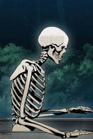

# L'improbable apparition de Monsieur Cadavre

Imaginez-vous, vous réveiller dans un trou dans la terre, fraichement retournée, une tombe récente.
N'ayant pas la moindre idée de la raison pour laquelle vous vous y trouvez.
Réussir péniblement à vous extriper de cette fosse pour en arriver à faire le terrible constat grâce au clair de lune que vous n'êtes désormais plus qu'un tas d'os ambulant et ignorez tout de votre personne jusqu'à votre prénom.
Eh bien, il s'agit de mon réveil à moi, Monsieur Cadavre.

Mes premiers pas furent timide, hésitant, mes os craquant de toutes part à chaque mouvement. Un bruit sinistre qui me suivrait pour toujours. J'avançais pourtant, souhaitant m'éloigner de cette fosse d'où je venais de me réveiller. Mais où allez ? Qui était-je ? Seulement Monsieur Cadavre ? Des bruits de pas pressé m'interpelèrent bientôt. J'hésitais, devrais-je rapidement me cacher de celui qui arriverait d'une seconde à l'autre?

J'eus à peine le temps de réfléchir que mon squelette se mit à courrir en direction d'un arbre afin de m'y cacher de l'inconnu qui était à ma poursuite. Bien caché, je puis enfin regarder qui en avait après moi. Après un rapide coup d'oeil, je reconnus très facilement Albert, le gardien du cimetière, qui faisait son tour quotidien. Après ce moment intense, je m'assis tant bien que mal au pied de mon arbre afin de me questionner sur mon avenir incertain. 